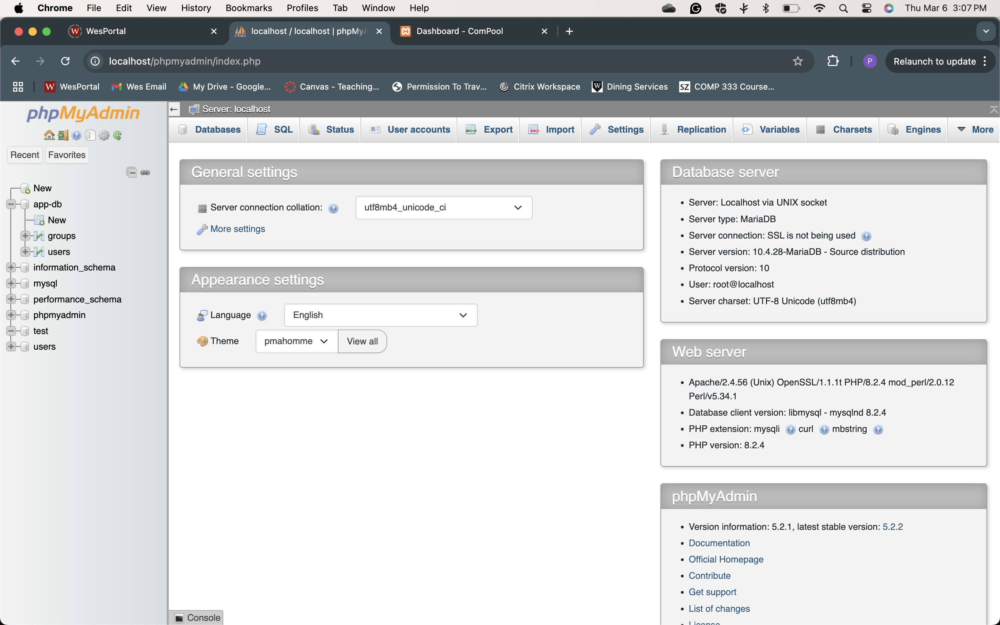
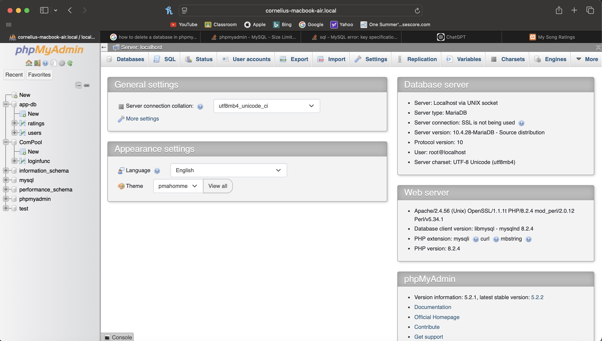
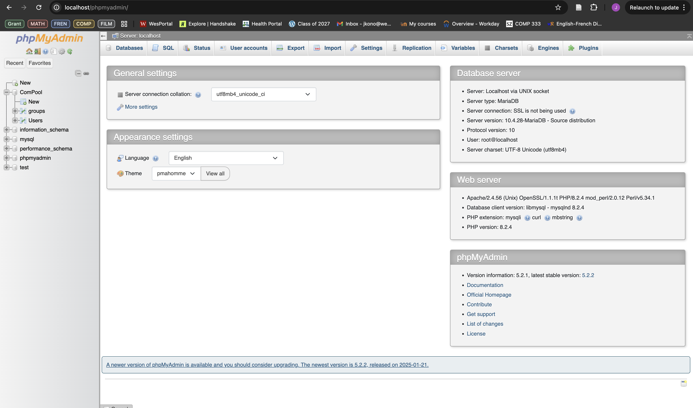

# 🏆 ComPool - Pool Money and Compete!

ComPool is a web application that allows users to create and manage pooled money groups with friends.  

---

## 📂 Project Overview
- This project is **HW #2**.
- All HW #1 files are stored in the **`HW 1`** folder.

---

## 🚀 Setting Up the Project

### 🔹 1️⃣ Prerequisites
Ensure the following are installed on your system:  
- **XAMPP** (for running PHP and MySQL locally)  
- **A Web Browser** 
- **A Code Editor**

---

### 🔹 2️⃣ Setting Up MySQL Database

#### **Step 1️⃣: Open phpMyAdmin**
- Download and start **XAMPP**, ensuring **MySQL Database** and **Apache Web Server** are running.
- Then open **phpMyAdmin** (`http://localhost/phpmyadmin/`).

#### **Step 2️⃣: Create the Database**
Go to the **Databases** tab in phpMyAdmin and create a new database called **`app-db`**, or execute the following SQL:
```sql
CREATE DATABASE IF NOT EXISTS `app-db`;
USE `app-db`;
```

#### **Step 3️⃣: Create the `users` Table**
Run this SQL command in the **SQL** tab of your new database (`app-db`):
```sql
CREATE TABLE IF NOT EXISTS users (
    username VARCHAR(50) PRIMARY KEY,
    password VARCHAR(255) NOT NULL
);
```

#### **Step 4️⃣: Create the `groups` Table**
Run this SQL command in the **SQL** tab of your new database (`app-db`):
```sql
CREATE TABLE IF NOT EXISTS groups (
    id INT AUTO_INCREMENT PRIMARY KEY,
    group_name VARCHAR(100) NOT NULL,
    username VARCHAR(50) NOT NULL,
    group_size INT NOT NULL CHECK (group_size > 0), 
    members TEXT NOT NULL,  -- Stores comma-separated usernames
    created_at TIMESTAMP DEFAULT CURRENT_TIMESTAMP,
    FOREIGN KEY (username) REFERENCES users(username) ON DELETE CASCADE
);
```

---

### 🔹 3️⃣ Setting Up the Web Application

#### **Step 1️⃣: Clone GitHub Repository into Your `htdocs` Folder**
Your files should be inside your `htdocs` folder, something like this:
```
C:/Applications/XAMPP/htdocs
```

#### **Step 2️⃣: Configure Database Connection if Needed**
Open `db_connect.php` and update database credentials if necessary.

Here is what the file should look like. Since we are running the app locally, you **probably don’t need to change anything** unless you added a password:
```php
<?php
$host = "localhost"; 
$user = "root"; 
$password = "";  // Default is empty for XAMPP
$database = "app-db";  

$db = new mysqli($host, $user, $password, $database);

if ($db->connect_error) {
    die("Connection failed: " . $db->connect_error);
}
?>
```

---

### 🔹 4️⃣ Running the Web Application
Once everything is set up, open your browser and go to:
```
http://localhost/comp333--2-website/
```
📌 **If your file path is slightly different, adjust accordingly.**

---

## 🔑 Features & Functionality

### ✅ **User Authentication**
- Register a new account  
- Login/logout functionality (**passwords are securely hashed**)  

### ✅ **Group Management (CRUD)**
- **View all groups**  
- **Create a new group** (with name, size, and members)  
- **Update a group** (change size, add/remove members)  
- **Delete a group**  

### ✅ **Validation Rules**
- **Group size must be a positive number.**  
- **Cannot select more members than allowed.**  
- **The group creator is always included in the group.**  
- **Usernames must be unique in the system.**  

📌 **Important Note for Local Testing:**  
Since your database is empty at the start, you will have **no user options** when adding a group.  
To avoid issues, make sure to **create more than one user** first! You will not be able to create a new group without specifying at least one member (this does not include yourself) 

---

## 🌍 Visiting on InfinityFree
Simply go to **[compool.ct.ws](https://compool.ct.ws/)** to see all features working with internet access and an SSL certificate.

---

## 📸 Local XAMPP Development Screenshots:

### **Pierce's Screenshot**


### **Cory's Screenshot**


### **Kenji's Screenshot**


Split: 33/33/33

[//]: # (Used Chatgpt to adhere to general design principals and best practices (specifically helped a lot with fixing our sql queries so that they were parameterized), as well as some other fixes (beautifying the README) and optimizations.)
